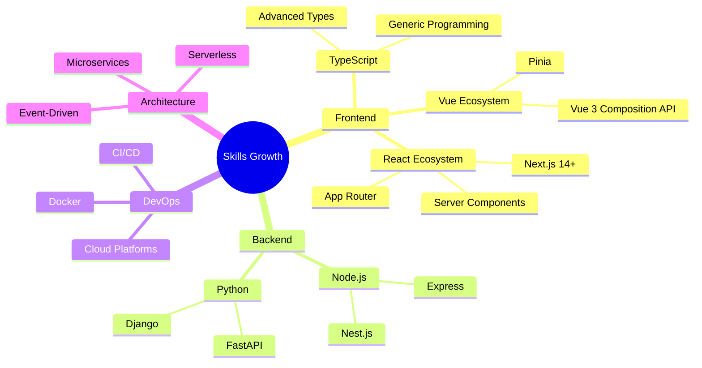

<div align="center">
  
  
  
  [](https://git.io/typing-svg)
  
  [](https://github.com/Z3FisherX?tab=followers)
  [](https://github.com/Z3FisherX?tab=repositories)
  [](https://github.com/Z3FisherX)
  
</div>

## 🚀 About Me

```typescript
const Z3FisherX = {
    pronouns: "He" | "Him",
    location: "China 🇨🇳",
    role: "Full-Stack Developer",
    code: ["TypeScript", "JavaScript", "Python"],
    technologies: {
        frontend: {
            frameworks: ["React", "Next.js", "Vue.js"],
            mobile: ["Taro", "React Native"],
            styling: ["TailwindCSS", "Styled-Components", "SCSS"]
        },
        backend: {
            runtime: ["Node.js"],
            frameworks: ["Express", "Nest.js"],
            databases: ["PostgreSQL", "MongoDB", "Redis"]
        },
        tools: ["Git", "Docker", "VS Code", "Figma"],
        architecture: ["Microservices", "Event-Driven", "Serverless"],
        currentFocus: "Building scalable web applications with modern tech stack"
    },
    funFact: "I debug with console.log() and I'm proud of it! 😄"
};
```

## 🛠️ Tech Stack

<div align="center">

### Frontend Development


### Backend Development


### Tools & Platforms


</div>

## 📊 GitHub Analytics

<div align="center">
  
  
  
  
</div>

<div align="center">
  
  [](https://git.io/streak-stats)
  
</div>

<div align="center">
  
  
  
</div>

## 🏆 GitHub Trophies

<div align="center">
  
  
  
</div>

## 🎯 Featured Projects

<div align="center">

<a href="https://github.com/Z3FisherX/yapi-to-ts">
  
</a>

<a href="https://github.com/Z3FisherX/report-error">
  
</a>

<a href="https://github.com/Z3FisherX/codeSetting">
  
</a>

</div>

### 🚀 Project Highlights

#### 🔧 Developer Tools
- **[yapi-to-ts](https://github.com/Z3FisherX/yapi-to-ts)** - 🎯 Tampermonkey script for converting YApi API docs to TypeScript
  - ⚡ One-click conversion
  - 🧠 Intelligent type inference  
  - 📋 Supports complex nested structures

#### 💼 Enterprise Solutions
- **Legal Document Management** - Full-stack platform for legal document handling
  - 🎨 Modern UI with Next.js + TypeScript
  - 🔐 Secure authentication & authorization
  - 📄 Document version control

- **YiKuai Enterprise Website** - Professional corporate web presence
  - ⚡ Built with Vue.js for optimal performance
  - 📱 Fully responsive design
  - 🎯 SEO optimized

- **Device Control System** - IoT device management platform
  - 📡 Real-time device monitoring
  - 🎛️ Intuitive control interface
  - 📊 Analytics dashboard

#### 🔬 Research & Innovation
- **MagicDuck** - AI-powered personalized children's picture book generator
  - 🤖 AI-driven content generation
  - 🎨 Custom illustrations
  - 📚 Educational storytelling

## 📈 Contribution Graph

<div align="center">
  
  
  
</div>

## 💻 Weekly Development Breakdown

<!--START_SECTION:waka-->
<!--END_SECTION:waka-->

## 🌟 What I'm Working On

- 🔭 Currently building scalable web applications with **Next.js** and **TypeScript**
- 🌱 Learning **Rust** and **WebAssembly** for performance-critical applications
- 👯 Looking to collaborate on open-source **TypeScript** and **React** projects
- 💬 Ask me about **React**, **Next.js**, **Vue.js**, **TypeScript**, or **Node.js**
- ⚡ Fun fact: I write code, break code, and then write more code to fix the code I broke

## 🎓 Continuous Learning



## 📫 Connect With Me

<div align="center">
  
  [](https://github.com/Z3FisherX)
  [](mailto:your.email@example.com)
  [](https://twitter.com/yourusername)
  [](https://linkedin.com/in/yourusername)
  
</div>

## 💡 Random Dev Quote

<div align="center">
  
  
  
</div>

## 🎵 Spotify Playing

<div align="center">
  
  [](https://open.spotify.com/user/yourusername)
  
</div>

---

<div align="center">
  
### 💭 Thought of the Day
  
*"Code is like humor. When you have to explain it, it's bad."* - Cory House

### Show some ❤️ by starring some of my repositories!
  
  
  
</div>
